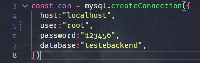
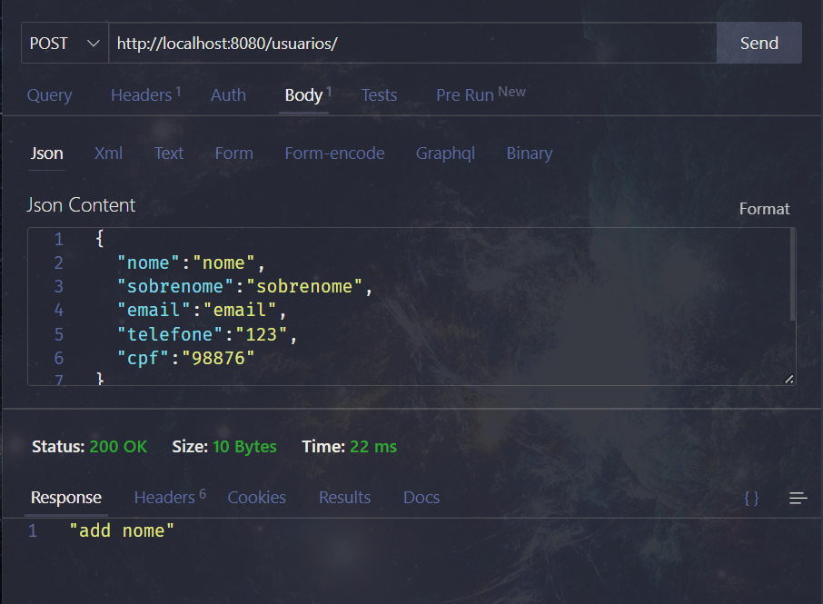
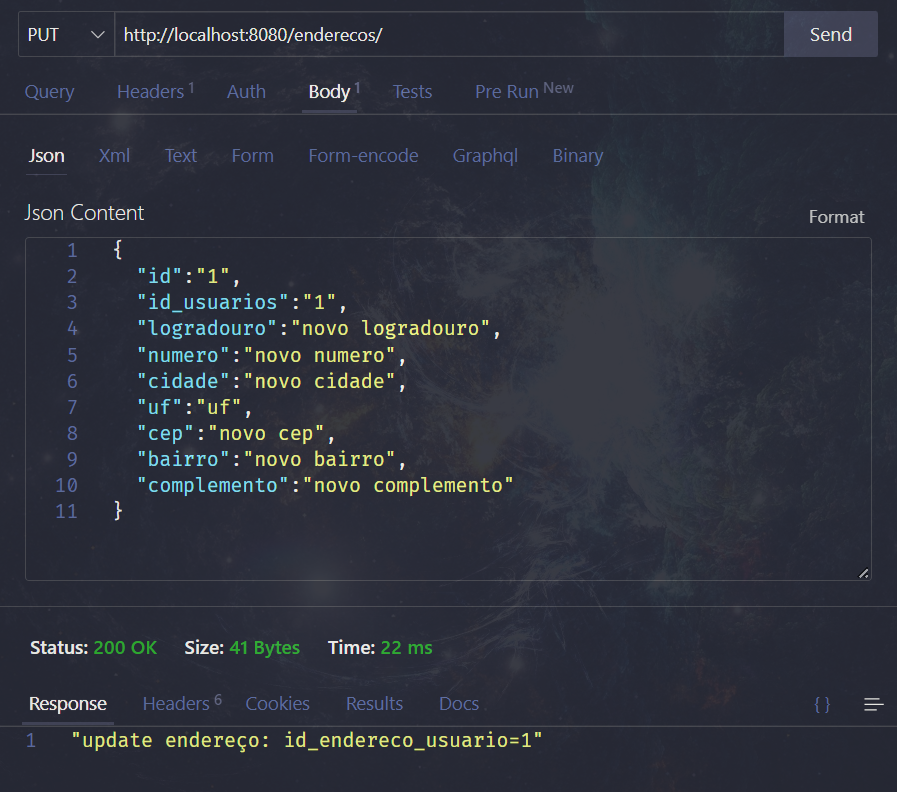

# BackEndTeste

por: Rodrigo Lopes

o banco de dados foi criado a parte sendo assim é necessario usar o MySQL Workbench para criar o banco de dados, execute no MySQL Workbench o arquivo testeDB.sql

### Iniciar servidor

`npm install` para instalar os pacotes usados
`npm start` para iniciar o servidor local
`http://localhost:8080` url padrão

- editar o usuario e senha da conexão com o banco de dados no arquivo: `./db/conection.js`


### Testes
o servidor se iniciará vazio então comece adicionando
para testar em 
usuários: `http://localhost:/usuarios`
endereços: `http://localhost:/enderecos`


para **POST**

usuário:
```json:
	{
	  "nome":"nome",
	  "sobrenome":"sobrenome",
	  "email":"email@email.com",
	  "telefone":"123456789",
	  "cpf":"12345645-12"
	}
```
 endereço:
```json:
	{
	  "id_usuarios":"1",
	  "logradouro":"logradouro",
	  "numero":"10",
	  "cidade":"cidade",
	  "uf":"uf",
	  "cep":"12345",
	  "bairro":"bairro",
	  "complemento":"complemento"
	}
```

**ex:**<br/>


---

para **GET** e **DELETE**
	
`http://localhost:/usuarios` - chamar todos<br/>
`http://localhost:/usuarios/1` - para chamar ou apagar um (GET e DELETE)<br/>
	<br/>
`http://localhost:/endereco` - chamar todos<br/>
`http://localhost:/endereco/1` - para chamar ou apagar um (GET e DELETE) <br/>

---

e para atualizar **PUT**

o primeiro `id` refere-se ao campo que será editado dentro de usuário ou endereço

usuário:
```json:
	{
	  "id":1,
	  "nome":"nome",
	  "sobrenome":"sobrenome",
	  "email":"email@email.com",
	  "telefone":"123456789",
	  "cpf":"12345645-12"
	}
```
 endereço:
```json:
	{
	  "id":1,
	  "id_usuarios":"1",
	  "logradouro":"novo logradouro",
	  "numero":"novo numero",
	  "cidade":"novo cidade",
	  "uf":"uf",
	  "cep":"novo cep",
	  "bairro":"novo bairro",
	  "complemento":"novo complemento"
	}
```

    
**ex:**<br/>

   

